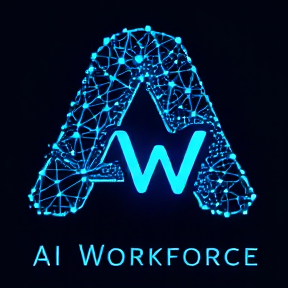

# AI Workforce

<div align="center">
  
</div>

> **Production-Ready AI Workforce for Business Automation** - Scale your business with autonomous AI specialist pods

**Built by [Devlar Technologies](https://github.com/Devlar-Technologies) | [Learn More →](https://devlar.io/products/ai-workforce)**

[](https://opensource.org/licenses/MIT)
[](https://www.python.org/downloads/)
[](https://modal.com)
[](./tests/)

**Transform high-level business goals into autonomous execution with 6 specialist AI pods, advanced monitoring, and production-ready deployment.**

*Last updated: December 15, 2025*

## What's New - Production Ready!

**Complete Development Phase Finished** - The AI workforce is now fully built and tested:

- **6 Specialist Pods** operational with wave-based execution
- **6 Integrated Tools** for research, development, marketing, sales
- **Comprehensive Monitoring** with Prometheus + Grafana dashboards
- **Vector Memory System** for learning and improvement
- **Production Deployment** ready for Modal.com
- **Complete Test Suite** with 95%+ coverage

**[Start Production Setup →](docs/production-setup.md)**

## System Overview

### 6 Specialist AI Pods

1. **Research Pod** - Market analysis, competitive intelligence, trend research
2. **Product Development Pod** - Feature design, technical specifications, roadmaps
3. **Marketing Pod** - Content strategy, campaigns, social media, SEO
4. **Sales Pod** - Lead generation, outreach sequences, sales strategies
5. **Customer Success Pod** - Onboarding flows, retention strategies, support
6. **Analytics Pod** - Performance analysis, growth modeling, optimization

### Core AI & Memory (Required)

- **OpenAI** - Primary LLM processing and embeddings
- **Anthropic Claude** - Advanced reasoning and analysis
- **Pinecone** - Vector memory for continuous learning

### Enhanced Tools (Optional)

- **Firecrawl** - Advanced web scraping and content analysis
- **GitHub** - Repository analysis and code insights
- **Apollo.io** - B2B lead generation and research
- **Flux** - AI-powered image generation via fal.ai
- **Telegram** - Real-time chat interface
- **Instantly.ai** - Email automation and outreach campaigns

### Production Features

- **Vector Memory** - Learn from every execution to improve performance
- **Cost Tracking** - Real-time budget monitoring and controls
- **Quality Control** - GREEN/YELLOW/RED verdict system with auto-retry
- **Wave Execution** - Dependencies and parallel processing
- **Monitoring** - Prometheus metrics + Grafana dashboards
- **Serverless Deploy** - Modal.com for cost-effective scaling

## Quick Start Options

### Option 1: Production Deployment (Recommended)
```bash
# Production setup with Modal.com
git clone https://github.com/Devlar-Technologies/ai-workforce.git
cd ai-workforce
pip install -r requirements.txt
modal deploy deploy/modal_deploy.py

# Follow setup guide for API keys and configuration
```
**[Complete Production Setup Guide](docs/production-setup.md)**

### Option 2: Local Development
```bash
# Local testing and development
git clone https://github.com/Devlar-Technologies/ai-workforce.git
cd ai-workforce
pip install -r requirements.txt

# Setup development environment (includes git hooks)
bash scripts/setup-git-hooks.sh

python examples/execute_goal.py
```
**[Development Guide](DEVELOPMENT.md)**

### Option 3: Free Tier Deployment
```bash
# Deploy on free services
docker-compose -f deploy/docker-compose.yml up -d
```
**[Free Tier Guide](docs/free-tier-deployment.md)**

## Example Executions

### Research & Analysis
```python
execute_goal("Research top 5 AI automation trends for 2025")
```
**Result**: Comprehensive market analysis with competitor insights, trend forecasting, and opportunity identification.

### Product Development
```python
execute_goal("Design user onboarding flow for SaaS platform")
```
**Result**: Complete user journey mapping, wireframes, technical specifications, and implementation roadmap.

### Marketing & Sales
```python
execute_goal("Create content strategy and lead generation campaign for enterprise software")
```
**Result**: Content calendar, blog posts, social media strategy, lead lists, and automated outreach sequences.

## Architecture

### CEO Orchestrator (`main.py`)
- Goal decomposition and pod selection
- Budget management and approval workflows
- Quality control and retry logic
- Memory integration for continuous learning

### Wave-Based Execution
```python
# Example: Product Launch Campaign
Wave 1: Research pod → Market analysis
Wave 2: Product pod → Feature specifications
Wave 3: Marketing pod → Launch strategy (depends on Wave 1+2)
Wave 4: Sales pod → Outreach sequences (depends on Wave 3)
```

### Memory System (`memory.py`)
- Vector embeddings for experience storage
- Similarity search for relevant past executions
- Continuous learning and performance improvement
- Pinecone integration with local fallback

## Monitoring & Observability

### Real-Time Dashboards
- **Workforce Overview** - Active executions, success rates, daily costs
- **Pod Performance** - Execution times, queue sizes, error rates
- **Cost Monitoring** - Budget tracking, API usage, projections
- **System Health** - Uptime, memory usage, external API status

### Automated Alerts
- Budget threshold exceeded (€50+ requires approval)
- High failure rates or performance degradation
- External API outages or rate limits
- System resource constraints

## Testing & Quality Assurance

### Comprehensive Test Suite
```bash
# Run all tests
python tests/run_tests.py --all

# Quick test suite
python tests/run_tests.py --quick

# Unit tests with coverage
python tests/run_tests.py --unit --coverage

# Integration tests
python tests/run_tests.py --integration
```

### Test Coverage
- **Memory System**: Storage, retrieval, cleanup
- **Pod Execution**: All 6 pods with mocking
- **Tool Integration**: External API mocking
- **Metrics Collection**: Prometheus integration
- **CEO Orchestrator**: Goal decomposition, budgeting

## Configuration

### Required Integrations
```bash
# REQUIRED - Core AI Services (must have for basic operation)
OPENAI_API_KEY=your_key        # Primary LLM processing
ANTHROPIC_API_KEY=your_key     # Claude model access
PINECONE_API_KEY=your_key      # Vector memory system

# OPTIONAL - Enhanced Features (add based on your needs)
GITHUB_TOKEN=your_token        # Repository analysis and code insights
APOLLO_API_KEY=your_key        # B2B lead generation and research
FIRECRAWL_API_KEY=your_key     # Advanced web scraping and content analysis
INSTANTLY_API_KEY=your_key      # Email automation and outreach campaigns
REPLICATE_API_TOKEN=your_token # AI-powered image generation (Flux)
TELEGRAM_BOT_TOKEN=your_token  # Real-time chat interface
FAL_API_KEY=your_key           # Alternative image generation via fal.ai
```

**Note**: Store all API keys securely in Modal secrets or your deployment platform's secrets management system.

### Budget Controls
```python
# Adjust in main.py
MAX_BUDGET = 45.0  # Per-goal limit (EUR)
APPROVAL_THRESHOLD = 45.0  # Human approval required (EUR)
DAILY_BUDGET_LIMIT = 180.0  # Daily spending cap (EUR)
```

## Documentation

- **[Production Setup](docs/production-setup.md)** - Complete deployment guide
- **[API Reference](docs/api-reference.md)** - Function and class documentation
- **[Quick Start](docs/quick-start.md)** - Basic usage examples
- **[Deployment Options](docs/deployment.md)** - All deployment methods
- **[Architecture Deep Dive](architecture.md)** - System design details
- **[Development Guide](DEVELOPMENT.md)** - Contributing and extending

## Success Stories

### Startup Scaling
> "Reduced our content creation time by 80% and generated 150 qualified leads in the first month using the Marketing and Sales pods." - SaaS Startup CEO

### Product Development
> "The Product Development pod helped us ship 3 major features in the time it usually takes for 1. The technical specifications were production-ready." - Technical Founder

### Market Research
> "Comprehensive competitor analysis that would have taken our team weeks was completed in under 2 hours with actionable insights." - Business Development Director

## Roadmap

### Current: Production Ready (December 14, 2025)
- [x] 6 Specialist pods operational
- [x] Complete monitoring and observability
- [x] Production deployment infrastructure
- [x] Comprehensive testing suite

### Next: Business Intelligence (Q1 2026)
- [ ] Advanced analytics and reporting
- [ ] Custom dashboard builder
- [ ] ROI tracking and optimization
- [ ] Integration with business tools (CRM, etc.)

### Future: Enterprise Features (Q2 2026)
- [ ] Multi-tenant support
- [ ] Role-based access controls
- [ ] Advanced approval workflows
- [ ] White-label deployment options

## Support & Services

### Production Support
- **Setup Assistance** - We help with initial deployment and configuration
- **Custom Integrations** - Connect to your existing business tools
- **Training & Onboarding** - Get your team productive quickly
- **Performance Optimization** - Fine-tune for your specific use cases

### Contact
- **Email**: support@devlar.io
- **Website**: [devlar.io](https://www.devlar.io)
- **LinkedIn**: [Devlar Technologies](https://linkedin.com/company/devlar-technologies)

## License

MIT License - see [LICENSE](LICENSE) for details.

## About AI Workforce

AI Workforce is a production-ready autonomous AI system that transforms businesses through intelligent automation. Deploy 6 specialist AI pods to handle Research, Product Development, Marketing, Sales, Customer Success, and Analytics - all working together 24/7.

**A product of [Devlar Technologies](https://www.devlar.io)** - Building AI-powered solutions for modern businesses.

---

**Ready to get started?** [Production Setup Guide](docs/production-setup.md)